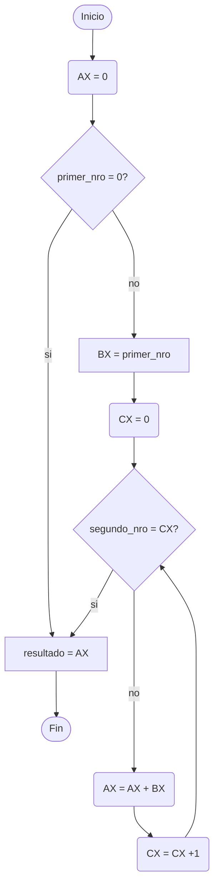
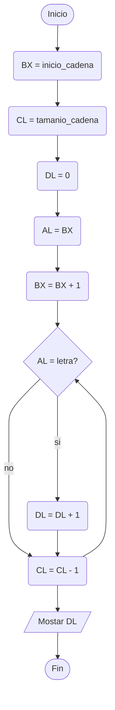

# Arquitectura de Computadoras (782)

- Profesora: *Ing. Celeste Guagliano*
- Alumno: *Pablo D. Origlia*

## Actividades del laboratorio 1 primer cuatrimestre 2023

### Laboratorio 1 - Actividades

#### *Ejercicio 1:* Codifique un programa que sume dos números con las siguientes características:

1. Los dos números a sumar se encuentran en los registros AX y BX.

```assembly
   add AX, BX
   hlt
end

```

2. Uno de los números a sumar se encuentra en un registro, mientras que el otro se encuentra en memoria.

```assembly
org 1000h    
    primer_nro dw 23h
org 2000h
    add AX, primer_nro
    hlt
end

```

3. ¿Cómo realizaría la suma de dos números que se encuentran almacenados en la memoria?

```assembly
org 1000h
    primer_nro dw 12h
    segundo_nro dw 23h
org 2000h
    mov AX, primer_nro
    add AX, segundo_nro
    hlt
end

```

4. ¿Qué ocurre si el resultado de la suma excede el tamaño del registro en el que se almacena?

El flag de *overfload* `(O)` cambia su valor a 1.

#### *Ejercicio 2:* Codifique un programa que reste dos números. ¿Qué ocurre si el resultado es menor a 0?

```assembly
org 1000h
    primer_nro dw 5423h
    segundo_nro dw 1212h
org 2000h
    mov AX, primer_nro
    sub AX, segundo_nro
    hlt
end

```

Si el resultado es menor a 0 el flag de *signo* `(S)` cambia su valor a 1.

#### *Ejercicio 3:* Codifique un programa que sea capaz de multiplicar dos números teniendo en cuenta el set de instrucciones del MSX88. Para ello:

1. Dividir la memoria entre el espacio para las variables necesarias y el espacio del código principal del programa.




```assembly

org 1000h
        primer_nro dw 5h      ; 1000
        segundo_nro dw 2h     ; 1002
        resultado dw ?        ; 1004
org 2000h
        mov AX, 0             ; incializo el registro acumulador
        cmp primer_nro, 0     ; me aseguro que el primer termino no es 0
        jz FIN                ; si lo es finalizo
        mov BX, primer_nro    ; cargo el primer termino
        mov CX, 0             ; inicializo el contador
ITERAR: cmp segundo_nro, CX   ; comparo el contador con el segundo termino
        jz FIN                ; si no son iguales sigo (a su vez la primera vez verifica que segundo_nro no sea 0)
        add AX, BX            ; sumo en el acumular el primer_nro almacenado en AL
        inc CX                ; incremeneto el contador
        jmp ITERAR            ; itero
FIN:    mov resultado, AX     ; al final envio el resultado a resultado
        hlt                   ; finalizo programa

end

```

2. Modifique el código anterior y realice una subrutina para la multiplicación que sea llamada desde el programa principal.

```assembly
org 1000h
        primer_nro dw 5       ; 1000
        segundo_nro dw 3      ; 1001
        resultado dw 0        ; 1002
org 2000h
        mov BX, primer_nro    ; envio a BX el primer_nro
        mov DX, segundo_nro   ; envio a DX el segundo_nro
        call MUL              ; llamo a la funcion multiplicar
        mov resultado, AX     ; el resultado acumulado en AX se guarda en resultado
        hlt                   ; detengo la ejercucion
MUL:    mov AX, 0             ; inicializo el registro AX donde almaceno el resultado
        cmp BX, 0             ; verifico que el primero_nro no sea 0
        jz FIN                ; si lo es voy a FIN
        mov CX, 0             ; inicializo el contador CX en 0
ITERAR: cmp DX, CX            ; comparo si el segundo_nro es igual al contador CX
        jz FIN                ; si lo es voy a FIN (a su vez la primera vez verifica que segundo_nro no sea 0)
        add AX, BX            ; voy acumulando la suma del primer_nro en AX
        inc CX                ; incremento CX
        jmp ITERAR            ; itero tantas veces como segundo_nro
FIN:    ret

end

```

#### *Ejercicio 4:* Codifique un programa que sea capaz de contar la cantidad de letras “a” presentes en una cadena de caracteres.



```assembly
org 1000h
        letra db 'a'  ; Letra a buscar
        cadena db "Esta es una cadena de texto de prueba." ; Cadena de 38 bytes y 5 a's.
        eos db ?      ; Fin del string
        
org 2000h
         mov BX, offset cadena               ; incio de la cadena
         mov CL, offset eos - offset cadena  ; tamanio de la cadena
         mov DL, 0                           ; ocurrencias de la letra
LAZO:    mov AL, [BX]                        ; letra en la posicion actual de la cadena
         inc BX                              ; incremento la posicion en la cadena
         cmp AL, letra                       ; comparo si la letra actual es la que buscamos
         jnz PROXIMO                         ; si es distinto sigo el recorrido
         inc DL                              ; sino incremento el contador de ocurrencias
PROXIMO: dec CL                              ; decremento el contador de recorrido
         jnz LAZO                            ; si no es cero sigo buscando

         hlt                                 ; detengo el problema
end

```
 
